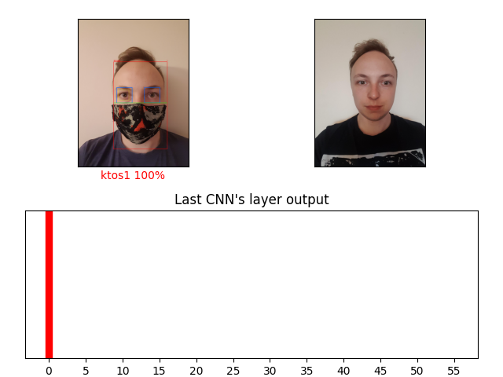

# Masked Face Recognition

This is the official repository for the engineering thesis: "Person recognition on the basis of the partial visible face"

## MaskedFaceRecognition

This directory contains all the scripts and models used during the research process. The models used for face detection, ROI selection and face recognition are stored in the "models" subdirectory.

## Website

This directory includes all of the necessary files for the Flask application. The full application was implemented for the dataset gathering purposes.

## Example results

This picture represents the results based on the single image.

Example results based on the video

